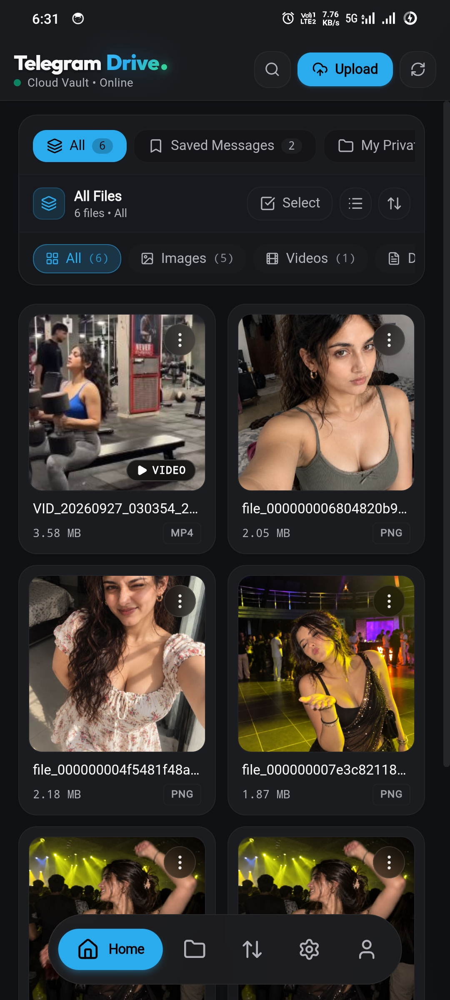
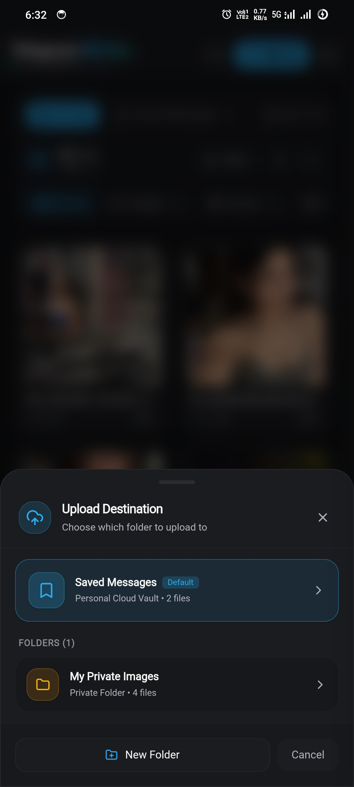
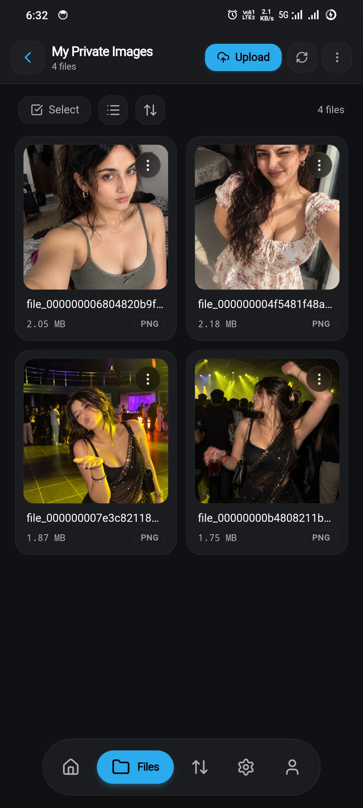
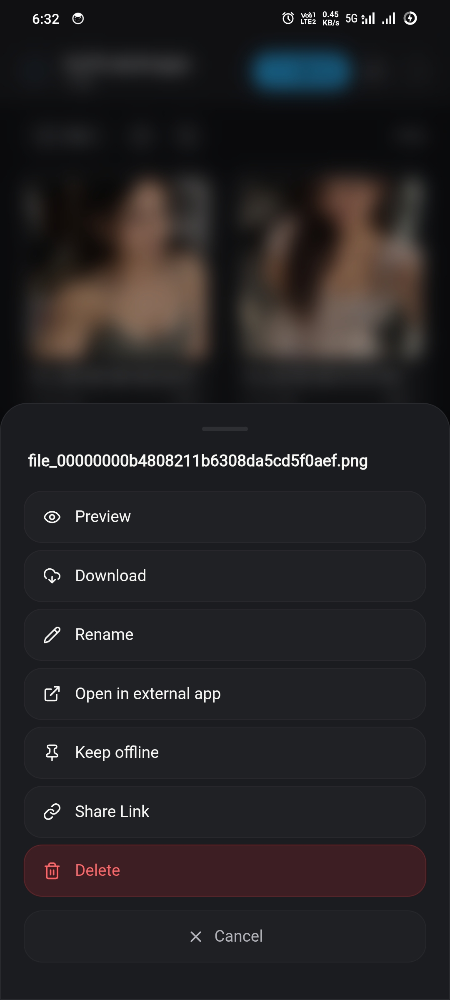
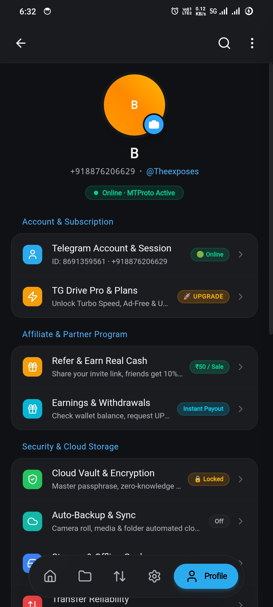
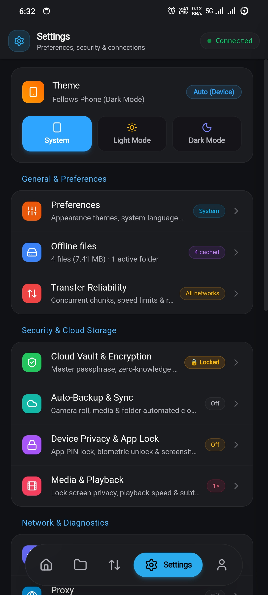

# 🚀 Telegram Drive (v1.0.0)

<p align="center">
  
</p>

<p align="center">
  <b>High-Performance Unlimited Cloud Storage Powered by Telegram Cloud Infrastructure</b>
</p>

<p align="center">
  <a href="https://github.com/eveyka/Telegram-Drive-Public/releases/tag/v1.0.0"></a>
  <a href="https://github.com/eveyka/Telegram-Drive-Public/releases"></a>
  <a href="https://github.com/eveyka/Telegram-Drive-Public"></a>
</p>

---

## 📸 Screenshots & UI Showcase

<table align="center" width="100%">
  <tr>
    <td width="50%" align="center">
      <b>🏠 Home Dashboard & Cloud Storage Analytics</b><br/><br/>
      <br/>
      <sub>Real-time cloud metrics, storage breakdown, quick access categories, and recent activity.</sub>
    </td>
    <td width="50%" align="center">
      <b>📁 File Explorer & Virtual Folder Tree</b><br/><br/>
      <br/>
      <sub>Seamless nested folder organization, instant search, sorting, batch operations, and tags.</sub>
    </td>
  </tr>
  <tr>
    <td width="50%" align="center">
      <b>⚡ High-Speed Transfer & Upload Queue</b><br/><br/>
      <br/>
      <sub>Multi-threaded chunked uploads, real-time speed gauges, automatic retry, and persistent transfer queue.</sub>
    </td>
    <td width="50%" align="center">
      <b>🔍 Media Streamer & File Previewer</b><br/><br/>
      <br/>
      <sub>Instant in-app preview for images, documents, video streaming, and detailed file metadata.</sub>
    </td>
  </tr>
  <tr>
    <td width="50%" align="center">
      <b>🧩 Power Tools & Direct Link Sharing</b><br/><br/>
      <br/>
      <sub>Direct download links, multi-channel syncing, cache cleaning, and advanced utilities.</sub>
    </td>
    <td width="50%" align="center">
      <b>👤 Account & Multi-Session Manager</b><br/><br/>
      <br/>
      <sub>Telegram profile connection, secure session authentication, and account statistics.</sub>
    </td>
  </tr>
  <tr>
    <td colspan="2" align="center">
      <b>⚙️ Preferences & Performance Settings</b><br/><br/>
      <br/>
      <sub>Customizable themes (Dark/Light), network concurrency sliders, download directories, and security controls.</sub>
    </td>
  </tr>
</table>

---

## 📦 Official Download Matrix (v1.0.0)

Choose the optimized binary for your device:

| Platform | Format / Type | Architecture | Size | Direct Download |
| :--- | :--- | :--- | :--- | :--- |
| **🪟 Windows** | NSIS Installer (`.exe`) | x64 (64-bit) | ~26.9 MB | [Download Setup](https://github.com/eveyka/Telegram-Drive-Public/releases/download/v1.0.0/TG-Drive-v1.0.0-Windows-x64-Setup.exe) |
| **🪟 Windows** | Standalone Portable (`.exe`) | x64 (64-bit) | ~16.2 MB | [Download Portable](https://github.com/eveyka/Telegram-Drive-Public/releases/download/v1.0.0/TG-Drive-v1.0.0-Windows-x64-Portable.exe) |
| **🤖 Android** | Optimized ARM64 APK (`.apk`) | ARM64 (arm64-v8a) | **12.4 MB** | [Download ARM64 APK](https://github.com/eveyka/Telegram-Drive-Public/releases/download/v1.0.0/TG-Drive-v1.0.0-Android-ARM64.apk) |
| **🤖 Android** | Universal Release APK (`.apk`) | All Architectures | **12.4 MB** | [Download Universal APK](https://github.com/eveyka/Telegram-Drive-Public/releases/download/v1.0.0/TG-Drive-v1.0.0-Android-Universal.apk) |
| **🍎 macOS** | Apple Silicon (`.dmg`) | M1 / M2 / M3 / M4 (ARM64) | ~9.1 MB | [Download Apple Silicon DMG](https://github.com/eveyka/Telegram-Drive-Public/releases/download/v1.0.0/TG-Drive-v1.0.0-macOS-Apple-Silicon-ARM64.dmg) |
| **🍎 macOS** | Intel (`.dmg`) | Intel 64-bit (x86_64) | ~9.5 MB | [Download Intel DMG](https://github.com/eveyka/Telegram-Drive-Public/releases/download/v1.0.0/TG-Drive-v1.0.0-macOS-Intel-x64.dmg) |
| **🐧 Linux** | AppImage (`.AppImage`) | x86_64 | ~87.1 MB | [Download AppImage](https://github.com/eveyka/Telegram-Drive-Public/releases/download/v1.0.0/TG-Drive-v1.0.0-Linux-x64.AppImage) |
| **🐧 Linux** | Debian Package (`.deb`) | x86_64 (Ubuntu/Debian) | ~9.9 MB | [Download DEB](https://github.com/eveyka/Telegram-Drive-Public/releases/download/v1.0.0/TG-Drive-v1.0.0-Linux-x64.deb) |
| **📱 iOS** | Direct Sideload IPA (`.ipa`) | iOS 15.0+ (ARM64) | Production | [Download iOS IPA](https://github.com/eveyka/Telegram-Drive-Public/releases/download/v1.0.0/TG-Drive-v1.0.0-iOS-Direct-Install.ipa) |
| **📱 iOS** | Simulator Bundle (`.zip`) | Apple Silicon Sim | Production | [Download Simulator](https://github.com/eveyka/Telegram-Drive-Public/releases/download/v1.0.0/TG-Drive-v1.0.0-iOS-Simulator-App.zip) |

---

## ✨ Key Features

- ☁️ **Unlimited Cloud Storage:** Leverage Telegram's secure distributed cloud infrastructure to store and stream files without storage limits.
- 🔒 **End-to-End Encryption:** Client-side encryption ensures only you have access to your data.
- ⚡ **Multi-Part Chunked Transfers:** Multi-stream concurrent uploading and downloading with automatic resumption on network switches.
- 🔔 **Native Mobile Background Transfers:** Android foreground service with live persistent notifications and MediaStore integration.
- 🖥️ **Cross-Platform Native Experience:** Built with ultra-lightweight native Rust cores and modern hardware-accelerated UI.
- 📁 **Virtual Folder Hierarchy:** Organize files with nested folders, tags, search, and instant in-app previews.

---

## 🛠️ Installation & Setup Guide

### 🪟 Windows
1. Download `TG-Drive-v1.0.0-Windows-x64-Setup.exe` (Installer) or `TG-Drive-v1.0.0-Windows-x64-Portable.exe` (Standalone).
2. Double-click to launch.
3. If Windows SmartScreen displays a warning, click **More info** → **Run anyway**.

---

### 🤖 Android
1. Download `TG-Drive-v1.0.0-Android-ARM64.apk` or `TG-Drive-v1.0.0-Android-Universal.apk`.
2. Open the `.apk` file on your Android device.
3. If prompted, allow **"Install Unknown Apps"** for your browser/file manager.
4. Tap **Install** and launch Telegram Drive.

---

### 🍎 macOS (Apple Silicon & Intel)
1. Download `TG-Drive-v1.0.0-macOS-Apple-Silicon-ARM64.dmg` (for M-series Macs) or `TG-Drive-v1.0.0-macOS-Intel-x64.dmg` (for Intel Macs).
2. Open the `.dmg` file and drag **TG Drive** into your `Applications` folder.
3. If macOS displays a Gatekeeper warning:
   - Right-click **TG Drive.app** in `Applications` and select **Open**.
   - Or run this command in Terminal:
     ```bash
     xattr -cr /Applications/TG\ Drive.app
     ```

---

### 🐧 Linux (AppImage & Debian)
- **AppImage:**
  ```bash
  chmod +x TG-Drive-v1.0.0-Linux-x64.AppImage
  ./TG-Drive-v1.0.0-Linux-x64.AppImage
  ```
- **Debian / Ubuntu (.deb):**
  ```bash
  sudo dpkg -i TG-Drive-v1.0.0-Linux-x64.deb
  sudo apt-get install -f # If any dependencies are missing
  ```

---

### 📱 iOS Sideloading
1. Download `TG-Drive-v1.0.0-iOS-Direct-Install.ipa`.
2. Sideload using your preferred installation tool:
   - **AltStore / SideStore**
   - **TrollStore**
   - **Sideloadly**
   - **Scarlet / Feather**

---

<p align="center">
  <b>Telegram Drive</b> is published and maintained by <b>Eveyka</b>.<br/>
  For support, updates, and releases, visit the <a href="https://github.com/eveyka/Telegram-Drive-Public">official public repository</a>.
</p>